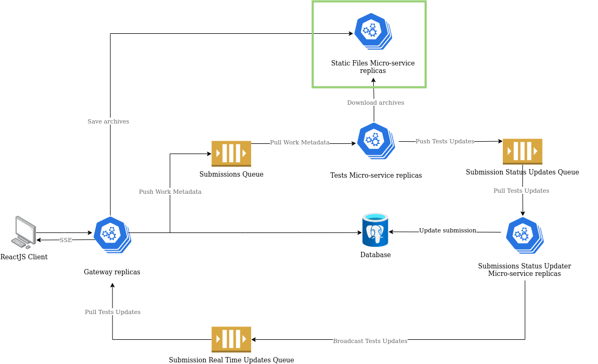

# Static Files Micro-service

Welcome to the static files micro-service. This service is responsible for storing and serving the following `.zip` archives: 

- `Templates`: Programming language templates we provide to teachers to write their own tests and to students to write their own solutions.

- `Tests`: Tests written by teachers to evaluate the students' solutions.

- `Submissions`: Students' solutions to the tests.

Below is a diagram of the overall architecture of the system with the Static Files micro-service highlighted in green.

## Documentation

Please, refer to the following documents for more information about the Static Files micro-service:

| Document | Description |
| --- | --- |
| [Contributing](./docs/contributing.md) | Contributing guidelines. |
| [Environment](./docs/environment.md) | A description of the environment variables used by the micro-service. |
| [Insomnia Collection](./docs/http/Insomnia.json) | An [Insomnia](https://insomnia.rest/) collection with the REST endpoints of the micro-service. |
| [OpenAPI Specification](./docs/openapi/spec.yaml) | An [OpenAPI](https://swagger.io/specification/) specification with the REST endpoints of the micro-service. |